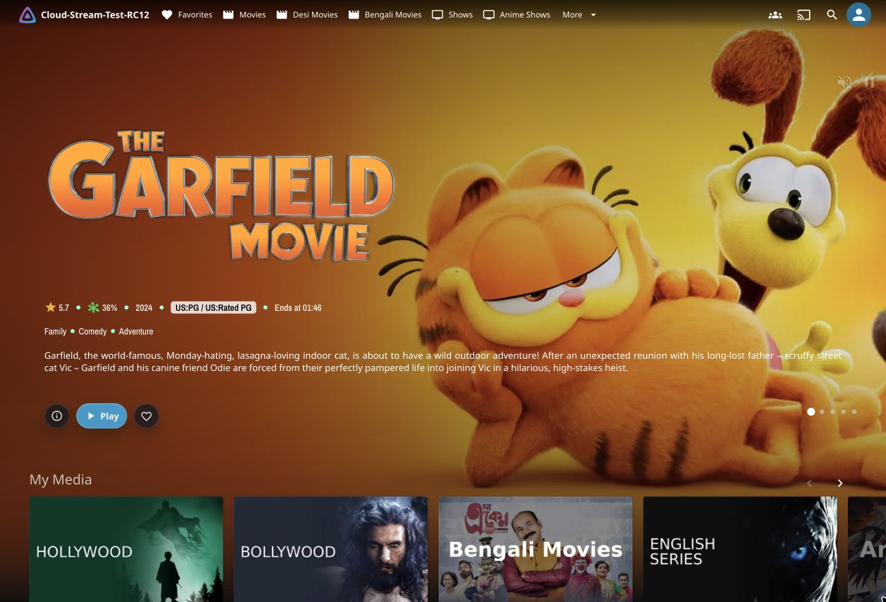
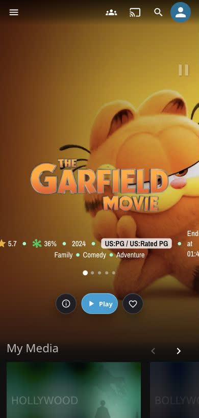

# Jellyfin-Media-Bar - Now with Play Now Function


## Important Update

**IMP UPDATE — We have dropped support for the normal CSS version (for now). _(It still works, but there will be no further updates till the fullscreen mode is stabilized)_** 

The fullscreen version has a new look (in beta), and support for different screen sizes has been added. For any visual goof-ups, please open a bug report, including the device being used and whether it is encountered in portrait or landscape mode.

## Jellyfin 12 Support

Jellyfin 12 can render either the legacy Desktop layout or the newer React/MUI layout. Use the `v12` branch for Jellyfin 12: legacy Desktop mode keeps the original MediaBar visual treatment with only the required Jellyfin 12 shell placement fix, while Auto/modern mode activates the separate `slideshowpure-v12.css` support layer for a more immersive edge-to-edge render on the official Jellyfin 12 shell.

### Jellyfin 12: Desktop / Legacy Layout

Jellyfin 12 Desktop/legacy mode keeps the original MediaBar visual treatment with only the required Jellyfin 12 shell placement fix.

### Jellyfin 12: Auto / Modern Layout

Jellyfin 12 Auto/modern mode activates the separate `slideshowpure-v12.css` support layer for a more immersive edge-to-edge render on the official Jellyfin 12 shell.

### Jellyfin 12: Modern Desktop Preview



### Jellyfin 12: Modern Mobile Preview



## Credits

Thanks to the Man, the Legend [BobHasNoSoul](https://github.com/BobHasNoSoul) for his work on the [jellyfinfeatured](https://github.com/BobHasNoSoul/jellyfin-featured) and [SethBacon](https://forum.jellyfin.org/u-sethbacon) and [TedHinklater](https://github.com/tedhinklater) for their take on the [Jellyfin-Featured-Content-Bar](https://github.com/tedhinklater/Jellyfin-Featured-Content-Bar). 

Here I present my version with some code improvements, loading optimizations, and security enhancements. Works best with the [Zombie theme](https://github.com/MakD/zombie-release) (_Shameless Plug_ `@import url(https://cdn.jsdelivr.net/gh/MakD/zombie-release@latest/zombie_revived.css);`, visit the repo for more color schemes).

## Before Installing

> <ins>**Before Installing, please take a backup of your index.html file**<ins>

## Existing Layout Screenshots

<details>
<summary> Desktop Layout </summary>
  

  
</details>

<details>

<summary> Mobile Layout </summary>
  


</details>


## Prepping the files

<details>
  
<summary>index.html</summary>

  1. Navigate to your `jellyfin-web` folder and search for the file index.html. (you can use any code editor, just remember to open with administrator privileges.
  2. Search for `</head>`
  3. Just before the `</head>`, plug the below code

### Jellyfin 10/11 or default branch

```
    <link rel="stylesheet" href="https://cdn.jsdelivr.net/gh/MakD/Jellyfin-Media-Bar@latest/slideshowpure.css" />
    <script async src="https://cdn.jsdelivr.net/gh/MakD/Jellyfin-Media-Bar@latest/slideshowpure.js"></script>
```

### Jellyfin 12 (`v12` branch)

For Jellyfin 12, use the dedicated branch:

```
    <link rel="stylesheet" href="https://cdn.jsdelivr.net/gh/MakD/Jellyfin-Media-Bar@v12/slideshowpure.css" />
    <link rel="stylesheet" href="https://cdn.jsdelivr.net/gh/MakD/Jellyfin-Media-Bar@v12/slideshowpure-v12.css" />
    <script async src="https://cdn.jsdelivr.net/gh/MakD/Jellyfin-Media-Bar@v12/slideshowpure.js"></script>
```

#### Jellyfin 12: Layout behavior

The v12 support layer is scoped behind a runtime layout check. If Jellyfin is set
to Desktop/legacy mode, the original `slideshowpure.css` visuals are preserved
with only the Jellyfin 12 shell placement fix applied. If Jellyfin is set to
Auto/modern mode, the script adds the modern layout class and the v12 support
layer takes over.
</details>

And that is it. Hard refresh your web page (CTRL+Shift+R) twice, and Profit!

## Want a Custom List to be showcased instead of random items??

No worries this got you covered. 

### Steps

1. Create a `list.txt` file inside your `avatars` folder.
2. In line 1 give your list a name.
3. Starting line 2, paste the item IDs you want to be showcased, one ID per line. For Example :

```
Awesome Playlist Name
ItemID1
ItemID2
ItemID3
ItemID4
ItemID5
```
The next time it loads, it will display these items.

## Uninstall the Bar

<details>
  
<summary> Roll Back </summary>

Restore the `index.html` file / remove the lines added and you are good to go!!!

</details>


## License

[](LICENSE)


This project is licensed under a DBAD license prohibiting any commercial use or redistribution.  
All modifications must be contributed back to this repository.  
Attribution to the original author (MakD) is required in any use or derivative work.

Please take a look at the [LICENSE](LICENSE) file for full terms.
